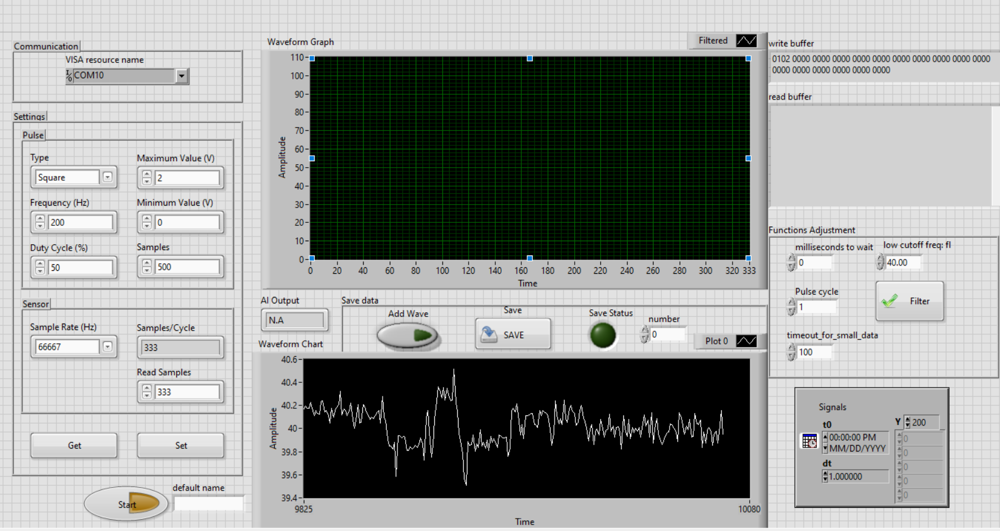

# Multi-classification Metal Thickness System using STM32

## Overview
This project presents an embedded system for metal thickness classification using sensor data acquisition, data-driven modeling, and deployment on STM32 microcontroller.

The system integrates real-time data acquisition, signal processing, and lightweight model inference under hardware constraints, targeting industrial inspection applications.

---

## System Architecture

The overall workflow consists of the following stages:

1. **Data Acquisition**
2. **System Control & Monitoring (LabVIEW Interface)**
3. **Data Storage (CSV Format)**
4. **Model Development**
5. **Embedded Deployment (STM32)**

---

## 1. Data Acquisition

- Sensor signals are collected using STM32-based hardware  
- ADC is used for real-time signal sampling  
- Data is transmitted to a host system for monitoring and storage  

---

## 2. LabVIEW Interface (Control & Visualization)

The system includes a LabVIEW-based interface for:

- Real-time system monitoring  
- Sending control commands to STM32  
- Visualizing sensor signals  
- Managing data acquisition process  

  

---

## 3. Data Storage

- Acquired data is stored in **CSV format**  
- Each dataset includes sensor readings corresponding to different metal thickness levels  
- Data is preprocessed for further analysis  

---

## 4. Model Development

- Data is analyzed and processed using Python  
- Normalization and preprocessing techniques are applied  
- A lightweight classification model is developed for thickness prediction  
- Multiple models are evaluated to select the optimal solution  

---

## 5. Embedded Deployment (STM32)

- The trained model is converted and deployed on STM32  
- Real-time inference is performed directly on embedded hardware  
- The system outputs classification results based on incoming sensor data  

---

## Key Features

- Real-time data acquisition and processing  
- Integration of LabVIEW for system control and visualization  
- Data-driven modeling for industrial signal analysis  
- Embedded deployment with resource-constrained optimization  
- End-to-end pipeline: sensing → processing → inference  

---

## Technologies Used

- **Embedded:** STM32, C  
- **Interface:** LabVIEW  
- **Data Processing:** Python (NumPy, etc.)  
- **Model Deployment:** TinyML (lightweight inference on MCU)  

---

## Applications

- Non-destructive testing (NDT)  
- Industrial inspection systems  
- Smart sensing and monitoring  

---

## Future Work

- Improve model robustness under noise conditions  
- Optimize inference latency on embedded hardware  
- Extend to regression-based thickness estimation  

---

## Author

- Khoi Do Duc
- GitHub: https://github.com/khoideptraivocung
